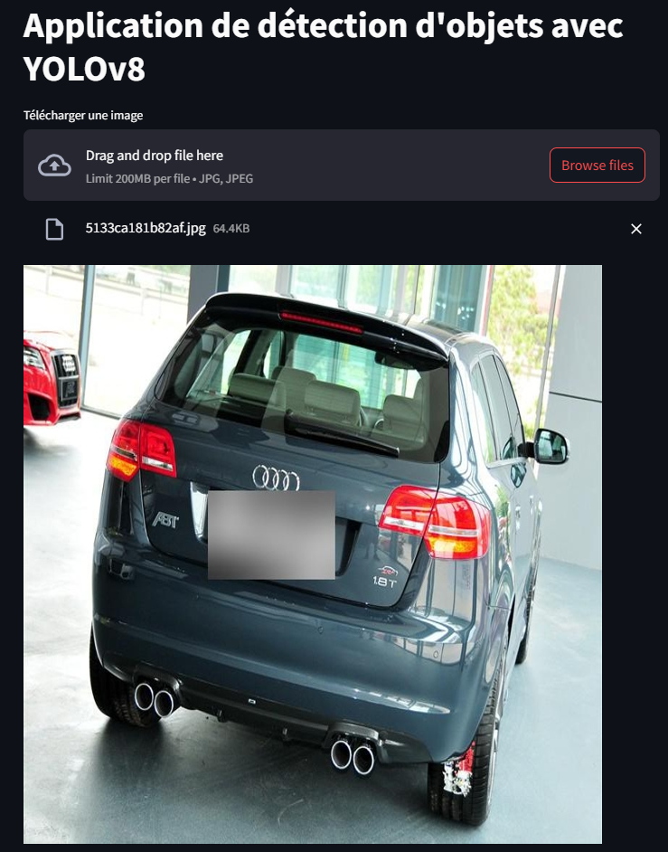

# Carlook

## Overview

Carlook is an innovative application designed to revolutionize the automobile industry. It enables users to effortlessly identify various car parts using image recognition technology and seamlessly integrates with marketplaces for automobile parts procurement.

### The Technology

Carlook stands out as the first app to offer a car part analysis tool. Mechanics or users can simply snap a photo of a vehicle, and the integrated AI promptly analyzes and identifies the parts visible in the image. This technology is geared towards automating the detection of car components, streamlining the repair and replacement process.

### Key Features

---

- **Advanced Object Detection**: Utilizes state-of-the-art image recognition to identify car parts from photographs.
- **User-Friendly Interface**: Simplified and intuitive design for easy navigation and usage.

### Upcoming Enhancements

---

- **Real-Time Object Detection**: Expanding capabilities to include live recognition of any car part using video input or camera roll.
- **Automated Photographic Capture**: Implementing real-time detection for immediate and automated photo capture.

### Usage

- **Model Testing & Extraction**: Leveraging Google Colab for rigorous testing of models and their subsequent extraction for practical application.

As demonstrated in Version 1:

1. **Photo Upload**: Users can start by uploading a photo of their vehicle. See an example of the upload interface here: 

2. **View Predictions**: Following the upload, the app displays the AI's predictions related to the photo. Check out the prediction interface: 

3. **Color-Coded Results**: Users can then see the results with color-coded annotations, indicating the specific car parts identified by the AI. Here's how the results are displayed: 

## Licensing

Carlook is released under the MIT License, ensuring open-source accessibility and development potential.

## Get in Touch

For inquiries or feedback regarding Carlook, feel free to reach out at [contact@polyblocks.xyz](mailto:contact@polyblocks.xyz).
